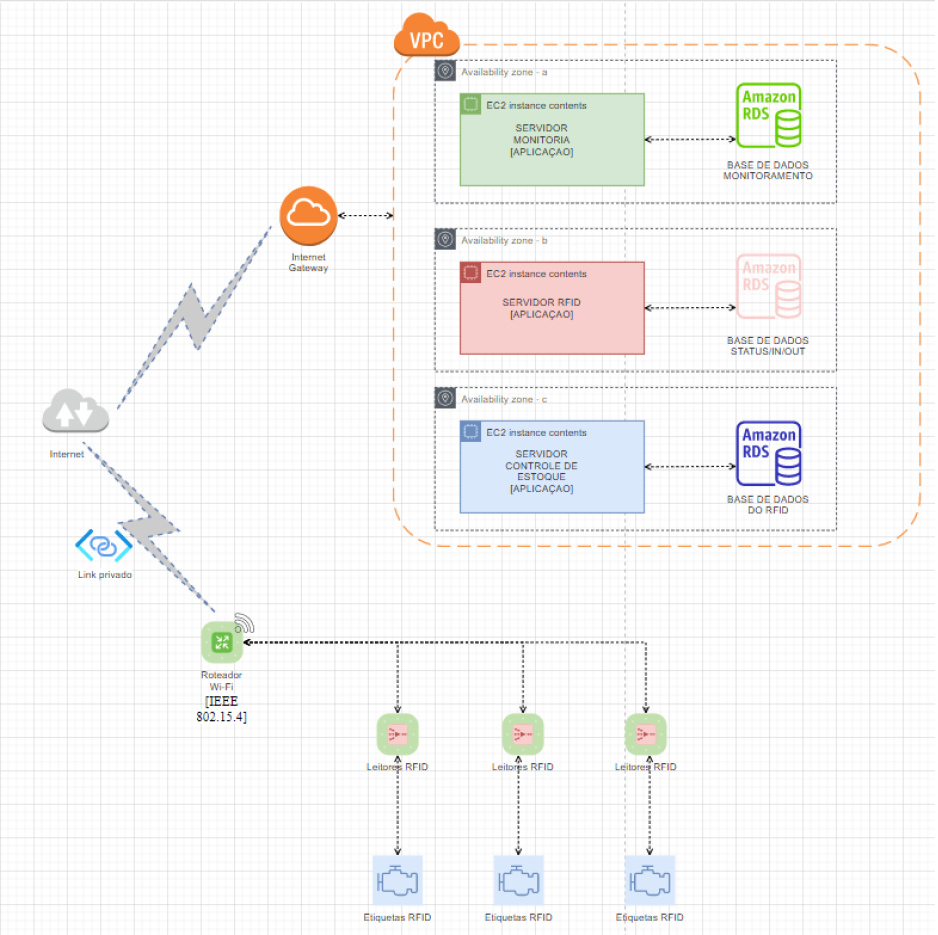
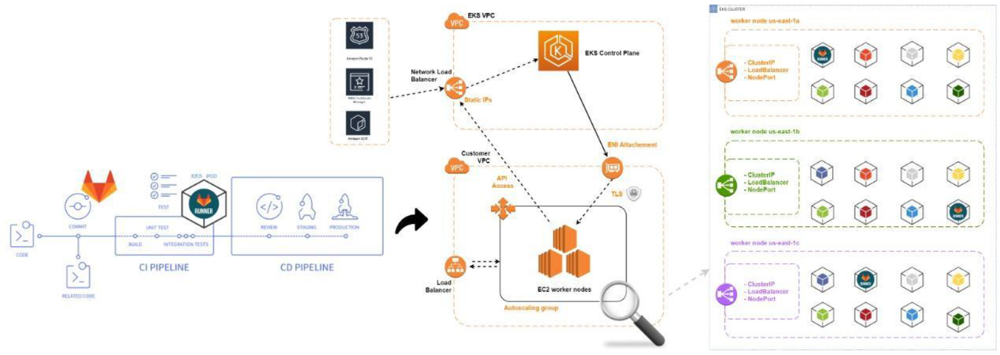
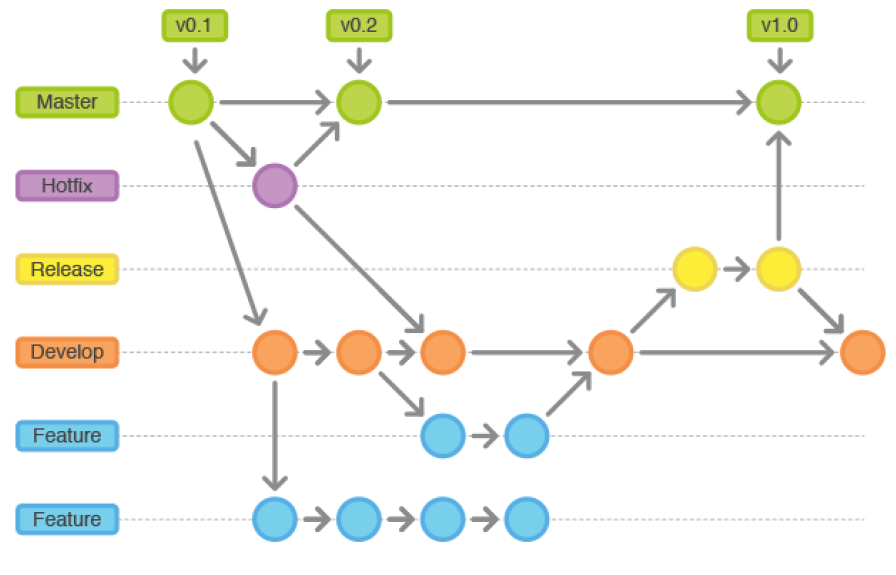
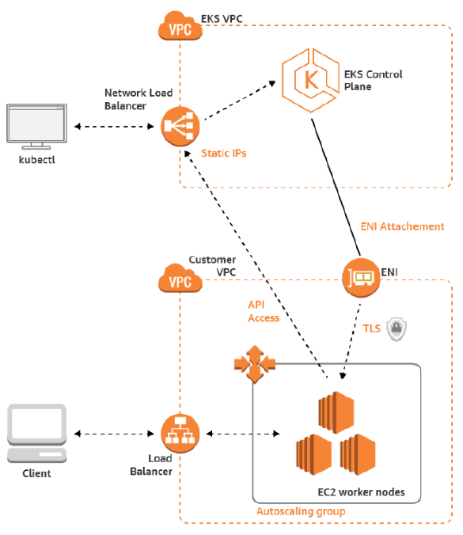
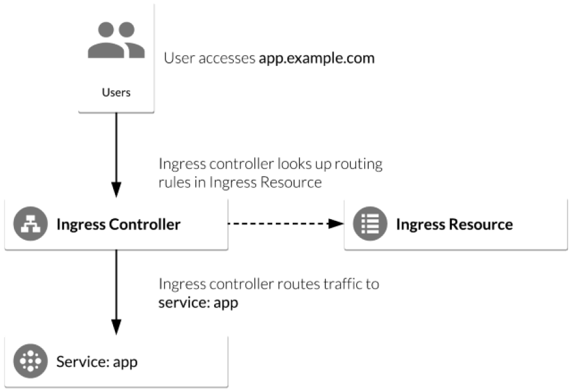

# Problema 

Atualmente, o controle e gerenciamento de produtos em pequenos e grandes negócios ainda é realizado por meio de processos manuais. Esses processos, além de exigirem mão de obra em grande escala, também são suscetíveis a falhas. Um bom exemplo é a logística de estoque em grandes varejistas e pequenos e médios comércios. A entrada e saída de produtos no estoque não é acompanhada em tempo real, podendo gerar imprevistos e prejuízos do ponto de vista financeiro.

# Público Alvo

O principal segmento mercadológico a ser alvo da solução é o varejista, desde pequenos a grande comércios, cujo o gerenciamento de estoque seja realizado de maneira manual. Os principais tipos são: 
<ul>
  <li>HIPERMECADOS</li> 
  <li>SUPERMERCADOS</li> 
  <li>LOJAS DE DEPARTAMENTO</li> 
  <li>LOJAS DE VARIEDADES</li> 
  <li>LOJAS DE ESPECIALIDADES</li> 
  <li>LOJAS DE CONVENIÊNCIA</li> 
  <li>LOJAS DE DESCONTO AGRESSIVO OU HARD DISCOUNT</li>
</ul>

# Recursos e Funcionalidades

Os principais recursos e funcionalidades presentes na solução serão:
<ul>
  <li>Indicador de entrada e saída de produtos (gerenciamento de estoque);</li>
  <li>Indicador de saldo total em caixa;</li>
  <li>Notificações sobre quantia mínima de estoque preestabelecidas pelo cliente;</li>
  <li>Visualização de estoque por categoria;</li>
  <li>Cadastro de produtos;</li>
  <li>Monitoramento e antifurto dos produtos;</li>
  <li>Atualização dos indicadores em tempo real por meio da automatização da contagem.</li>
</ul>

# Tecnologias Utilizadas

Tecnologias utilizadas no desenvolvimento da aplicação e na arquitetura da solução:
<ul>
  <li>React-Native;</li>
  <li>RFID;</li>
  <li>Amazon RDS;</li>
  <li>Leitor RFID;</li>
  <li>Roteador Wi-Fi.</li>
</ul>



# Soluções Preexistentes

Algumas das soluções similares existentes hoje estão disponíveis nas lojas App e Apple Store. As principais diferenças entre estas e a solução proposta são o uso da tecnologia RFID (todas usam código de barras), alguns realizam controle de fornecedores, importação de Nota Fiscal Eletrônica (NFe), entre outros.
<ul>
  <li>Contestoque;</li>
  <li>EstoqueApp;</li>
  <li>EstoqueSimples;</li>
  <li>Controle de Vendas Fácil;</li>
  <li>Pedidos, Vendas, Estoque e Controle Financeiro.</li>
</ul> 

# DETALHAMENTO DE ARQUITETURA ESTEIRA CI/CD



## VERSIONAMENTO DE CÓDIGO ${APPLICATION}-API:

Todo o processo de vercionamento da aplicação em nossa arquitetura é realizado no SCM https://gitlab.com (Gitlab Cloud);
O padrão adotado para o nosso workflow de desenvolvimento foi o gitflow. O Gitflow é ideal para projetos que têm um ciclo de lançamento agendado. Este fluxo de trabalho não adiciona novos conceitos ou comandos além do necessário para o Fluxo de trabalho de ramificação de recursos. Em vez disso, ele atribui funções bem específicas para diferentes ramificações e define quando elas devem interagir. Além das ramificações de recursos, ele utiliza ramificações individuais para preparar, manter e registrar lançamentos.
A pipeline utilizada para realizar o build, teste, versionamento da imagem Docker é o gitlab-ci.

# LISTA DE RECURSOS UTILIZADOS DO GITLAB:
<ul>
  <li>Gitlab-SCM;</li> 
  <li>Gitlab-CI;</li>
  <li>Gitlab Container Registry;</li>
  <li>Gitlab Artifacts Registry;</li>
  <li>Gitlab integrated kubernetes connections.</li>
</ul>

# DEFINIÇÃO DE AMBIENTE PARA DEPLOYMENT:

## GitlLab Cloud:

Para o nosso cenário de aplicação, definimos que a melhor solução para a proposta será adotar uma nuvem pública, escolhemos a AWS por sua vasta lista de recursos, possibilidade de integração com o nosso SCM (GitlLab) e melhor flexibilidade proporcionando maior economia na utilização de recursos inutilizados.



## Kubernetes(EKS):

Nossa API se baseia na arquitetura de desenvolvimento baseado em Microserviços. Com base nisso, decidimos utilizar o Kubernetes para gerenciar, monitorar e disponibilizar nossa aplicação, tendo em vista a vasta lista de recursos disponíveis para facilitar a gerência e o auto escalar verticalmente (scale up) significa adicionar recursos em um único nó do sistema (mais memória ou um disco rígido mais rápido). Escalar horizontalmente (scale out) significa adicionar mais nós ao sistema, tais como uma nova instância EC2 com uma aplicação para clusterizar o software.



## Nginx-ingress-controller:

Ingress controller é o interpretador do ingress resource, pelo fato de estarmos utilizando um serviço de kubernetes gerenciado como GKE, EKS e AKS, optamos por um serviço mantido pela comunidade kubernetes, proporcionando melhor integração e suporte, também por ser uma das ferramentas de controle de ingresso e egresso mais utilizada no mundo nativo de nuvem. Ingress-controller é um componente que permite descrever como queremos externalizar nossos serviços, se vamos utilizar SSL/TLS, para onde vamos direcionar o roteamento de tráfego, se teremos controle de acesso, websocket e etc.



## AWS Network Load Balancer:

O Elastic Load Balancing distribui automaticamente o tráfego de entrada de aplicações entre diversos destinos, como instâncias do Amazon EC2, contêineres, endereços IP, funções do Lambda e dispositivos virtuais. O serviço pode lidar com a carga variável de tráfego das aplicações em uma única zona de disponibilidade ou em diversas zonas de disponibilidade. O Elastic Load Balancing oferece quatro tipos de balanceadores de carga, todos eles com a alta disponibilidade, a escalabilidade automática e a segurança robusta necessárias para tornar as aplicações tolerantes a falhas.

## AWS Route 53:

O Amazon Route 53 é um web service Domain Name System (DNS) na nuvem altamente disponível e escalável. Ele foi projetado para oferecer aos desenvolvedores e empresas uma maneira altamente confiável e econômica de direcionar os usuários finais aos aplicativos de Internet, convertendo nomes como www.example.com para endereços IP numéricos como 192.0.2.1, usados pelos computadores para se conectarem entre si. O Amazon Route 53 também é totalmente compatível com o IPv6.

# Getting Started

### Reference Documentation

These are APIs that we need to provide:

```yaml
Methods	    Urls                                    Actions

POST        /api/estabelecimento                    create new Tutorial
GET         /api/estabelecimento                    retrieve all estabelecimento
GET         /api/estabelecimento/:id                retrieve a Tutorial by :id
PUT         /api/estabelecimento/:id                update a Tutorial by :id
DELETE	    /api/estabelecimento/:id                delete a Tutorial by :id
DELETE	    /api/estabelecimento                    delete all estabelecimento
GET         /api/estabelecimento/published          find all published estabelecimento
GET         /api/estabelecimento?nome=[keyword]     find all estabelecimento which name contains keyword
```

## Spring Boot, MySQL, JPA, Hibernate Rest API

Build Restful CRUD API for a simple 'Agencias' application using Spring Boot, Mysql, JPA and Hibernate.

## Requirements

1. Java JDK (v8+) (https://www.oracle.com/technetwork/java/javase/downloads/index.html)
2. Maven (v3+) (https://maven.apache.org/download.cgi)
3. MySQL

## How-To Local Setup

**1. Clone the application**

```bash
git clone https://github.com/2TDST-CHALLENGE/Digital-Business-Enablement.git
```

**2.0 Running local Docker Mysql Container**

```bash
$ docker run --name fiap-mysql -p 3306:3306 -e MYSQL_ROOT_PASSWORD=root -e MYSQL_DATABASE=est_digital_db -d mysql
```

**3. Change mysql username and password as per your installation**

+ open `src/main/resources/application.properties`

+ change `spring.datasource.username` and `spring.datasource.password` as per your mysql installation

**4. Build and run the app using maven**

```bash
mvn package

java -jar target/est-digital-api.jar
```

Alternatively, you can run the app without packaging it using:

```bash
mvn spring-boot:run
```

The app will start running at <http://localhost:8080>.

You can test them using postman or any other rest client.

# Executando ambiente em Docker

**1.0 Executando em seu local Docker, o Digital-Business-Enablement Container**

## Executando o Build da imagem docker local

```bash
git clone https://github.com/2TDST-CHALLENGE/Digital-Business-Enablement.git
cd Digital-Business-Enablement
```

```bash
$ docker-compose up -d
```

## Validando ambiente

```bash
$docker ps

CONTAINER ID   IMAGE                        COMMAND                  CREATED         STATUS         PORTS                                                  NAMES
2abba56c2325   Digital-Business-Enablement     "java -jar /app.jar"     7 minutes ago   Up 7 minutes   0.0.0.0:8080->8080/tcp, :::8080->8080/tcp              Digital-Business-Enablement
e0517e9359be   mysql:5.7                         "docker-entrypoint.s…"   7 minutes ago   Up 7 minutes   0.0.0.0:3306->3306/tcp, :::3306->3306/tcp, 33060/tcp   Digital-Business-Enablement

```
